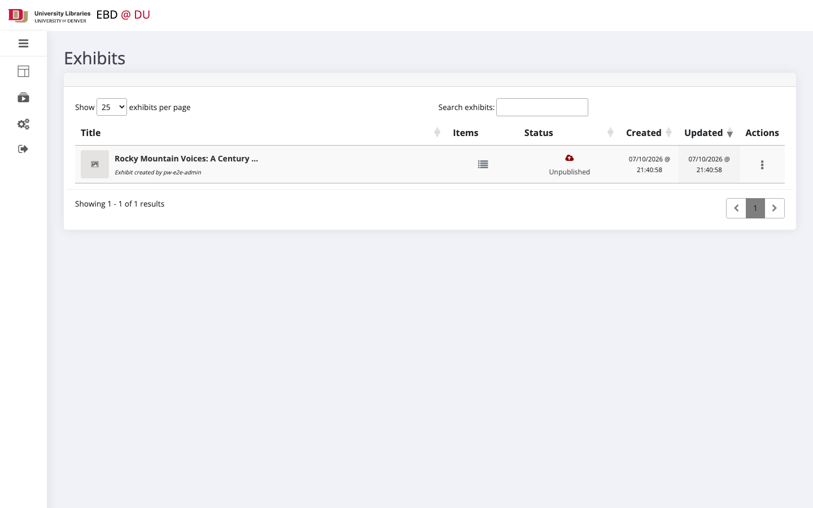
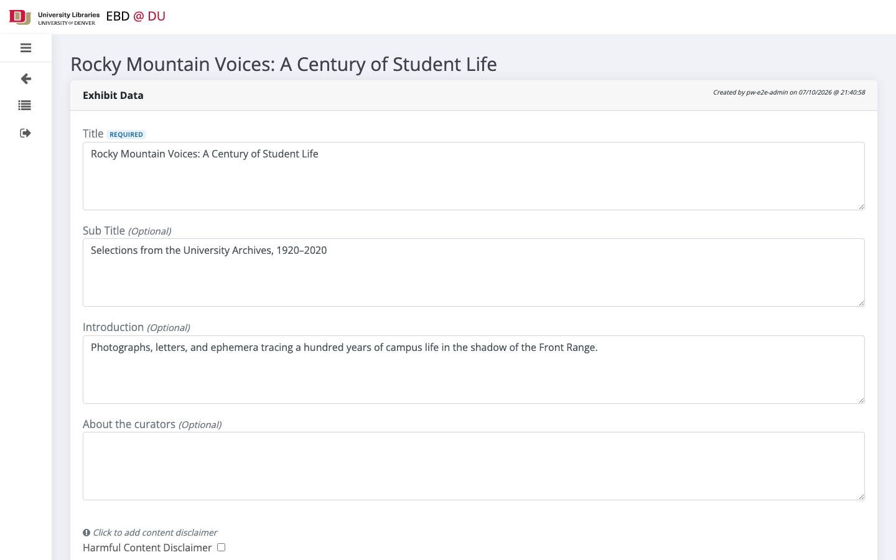
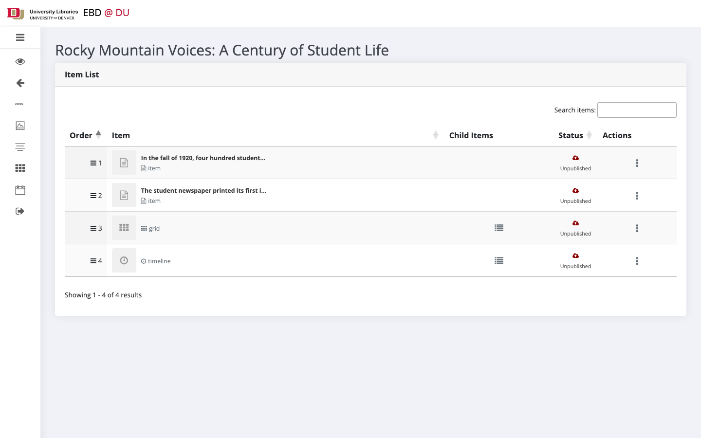
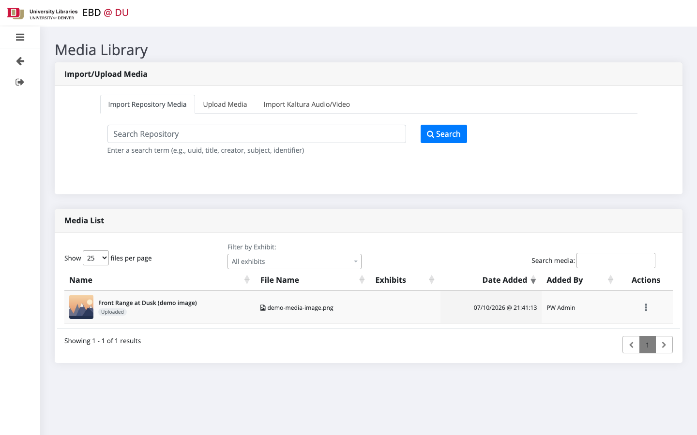
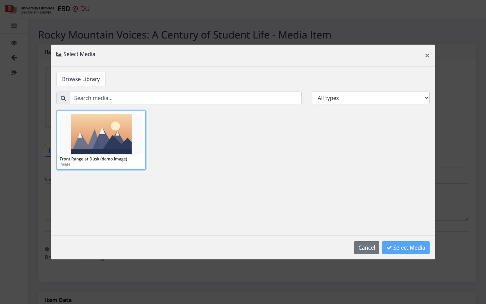
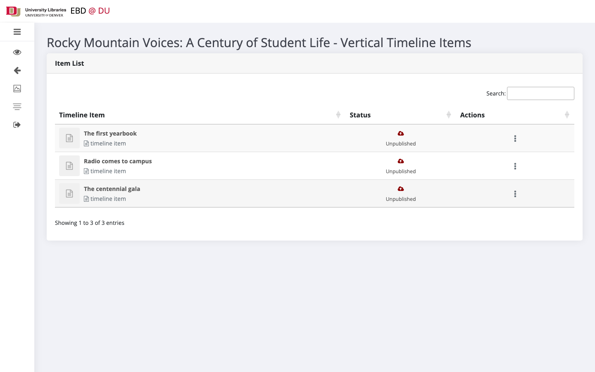

# DU Exhibits Builder

## Table of Contents

* [README](#readme)
* [Architecture Overview](#architecture-overview)
* [Releases](#releases)
* [Contact](#contact)

## README

### Background

Backend and dashboard for the University of Denver Libraries' online exhibits platform — exhibits are built from a central media library (uploads with IIIF 3.0, DU Digital Repository imports, Kaltura A/V), managed under role-based access, and published via Elasticsearch to a public frontend ([exhibits-frontend](https://github.com/dulibrarytech/exhibits-frontend)).

### Screenshots

**Exhibits list**


**Exhibit edit form**


**Exhibit item list — standard items, grids, and timelines**


**Media Library — upload, repository import, and Kaltura import**


**Media picker on the item form**


**Vertical timeline items**



### Contributing

Check out our [contributing guidelines](/CONTRIBUTING.md) for ways to offer feedback and contribute.

### Licenses

[Apache License 2.0](https://www.apache.org/licenses/LICENSE-2.0).

All other content is released under [CC-BY-4.0](https://creativecommons.org/licenses/by/4.0/).

### Local Environment Setup

**Prerequisites**

* Node.js **>= 20.19** — enforced via `package.json` `engines` + `.npmrc` (`engine-strict=true`), so `npm ci` fails fast on older Node. Servers run Node 22 LTS.
* MySQL **8+** or MariaDB **10.6+**
* Optional (full functionality): the Elasticsearch cluster, repository API, and Kaltura are DU-internal — indexing, repository imports, and Kaltura imports need DU network. Core dashboard CRUD works without them.

**Install and configure**

```
cd exhibits-backend
npm ci                        # always npm ci — never ad-hoc npm install on a shared checkout
cp .env-example .env          # then fill in values
mkdir -p logs                 # gitignored; the logger does not create it
```

**Database (migrations + seeds — no schema dumps needed)**

```
# create an empty database (name = DB_NAME in .env), then:
npx knex migrate:latest       # full schema from the baseline migration forward
npx knex seed:run             # RBAC: 4 roles + permissions matrix (db/seeds/)
```

Seeds create roles/permissions but no users. Create the first admin once (role_id 1 = Administrator on a freshly seeded DB):

```sql
INSERT INTO tbl_users (du_id, email, first_name, last_name, is_active)
VALUES ('871234567', 'you@du.edu', 'First', 'Last', 1);
INSERT INTO ctbl_user_roles (user_id, role_id) VALUES (LAST_INSERT_ID(), 1);
```

**Build and run**

```
npm run build                 # full: esbuild JS bundles + gulp views/css
npm start                     # node exhibits-backend.js
# → http://localhost:8004/exhibits-dashboard/auth
```

Partial builds: `npm run build:js` (bundles only) / `npm run build:views` (gulp only). After ANY client-side
change, rebuild **and bump `BUILD_VERSION` in `.env`** — bundle URLs are cache-busted by that value, so a
rebuild alone still serves the stale cached bundle.

**Tests**

```
npm test                      # server-side: vitest unit + jest integration
npm run test:e2e:install      # one-time: installs Chromium for Playwright
npm run test:e2e              # stubbed browser suite (no DB/network dependencies)
npm run test:e2e:live         # live full-stack suite (auto-creates + migrates the exhibits_e2e DB)
npm run test:e2e:live:external  # @external repo + Kaltura round-trips (DU VPN required)
npm run test:predeploy        # the full pre-deploy gate: unit + integration + stubbed + live
```

`@playwright/test` is pinned exactly (see package.json) so local and server runs use identical browser
behavior. (`tools/install-cdn-libs.js` is maintenance-only — vendored libraries in `public/libs/` are
committed; a fresh clone does not need it.)

### Maintainers

@freyesdulib, @lina-du, @kimpham54

### Acknowledgments

@bethmaw - Project Manager — UI/UX design

## Architecture Overview

The Exhibits Builder backend is an Express application serving two things: the server-rendered
dashboard (EJS + vanilla-JS modules) and the REST API it talks to. Content lives in MySQL/MariaDB; published
exhibits are indexed into Elasticsearch, where the
[exhibits-frontend](https://github.com/dulibrarytech/exhibits-frontend) reads them.

```
Curator ──▶ dashboard (EJS views + public/app modules)
                 │  REST (JWT)
                 ▼
                routes ──▶ controller ──▶ model ──▶ tasks ──▶ MySQL/MariaDB
                                        │
                                        ▼
                                     indexer ──▶ Elasticsearch ──▶ exhibits-frontend
                                     
External: DU SSO (auth) · DU Digital Repository API (imports) · Kaltura (A/V) · IIIF 3.0 (media delivery)

```

## Releases
* v1.2.14-build-73
* v2.0.0-build-234


## Contact

Ways to get in touch:

* Fernando Reyes (Developer at University of Denver) - fernando.reyes@du.edu
* Create an issue in this repository
